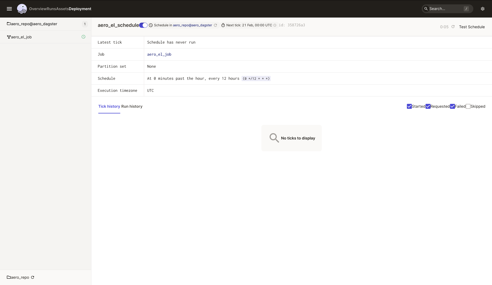

## Aero test task

Реализация простой EL такси 

Реализована схема full-refresh

### Stack

Используемые технологии

 - dagster
 - pandas

### Деплой

Надо запустить docker-compose.yml со следующими переменными окружения:

Параметры источника
 - SRC_REST_URL - url источника данных, должен возвращать json

Параметры целевой базы(поддерживается postgres)
 - DST_HOST
 - DST_PORT
 - DST_DBNAME
 - DST_USER
 - DST_PASSWORD
 - DST_TARGET_TABLE
 - DST_TARGET_SCHEMA

Параметры вспомогательной базы, разворачивается как сервис docker-compose-a
 - DAGSTER_POSTGRES_USER
 - DAGSTER_POSTGRES_PASSWORD
 - DAGSTER_POSTGRES_DB
 - DAGSTER_CURRENT_IMAGE

```bash
docker-compose up -d
```

UI дагстера можно увидеть на 3000 порту, там можно включить крон для отработки джобы раз в 12 часов

Можно разово запустить такску в данном UI:


Включить крон:

